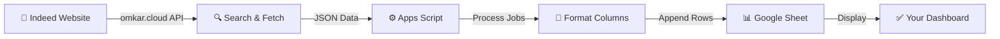

<div align="center">


<br/>

# 🚀 Indeed Job Automation (100% Free)


<br/>

[](https://sheets.google.com/)
[](https://omkar.cloud/)
[](https://script.google.com/)
[](.)
[](.)

<br/>


<br/>

> ✨ Automatically fetch job listings from Indeed using the **omkar.cloud free API** and sync them directly to your Google Sheet. No credit card, no bank account, no service account required. Just pure automation magic. 🪄

<br/>

[](https://docs.google.com/spreadsheets/d/1r6Hta4H9zItMpQYEKiX27MoDDeohcRbPfyl5tVydAjo/edit)
[](https://github.com/AbdulAzeemHashmi/indeed-job-automation)

</div>

<div align="center">

</div>

<br/>

<div align="center">

### ⚙️ Powered By Fully Automated Syncing


</div>

<br/>

## 📊 Quick Stats

<div align="center">


<br/><br/>

**Setup Progress Preview:**

```
[██████████████████████████████████████] 100% Complete
1️⃣ Get API Key   2️⃣ Open Sheet   3️⃣ Apps Script   4️⃣ Add Code   5️⃣ Set Key   6️⃣ Run   7️⃣ Schedule
```

</div>

<br/>

## 📋 Table of Contents

| Section | Link |
|:--------|:-----|
| 🎬 Demo | [Jump to Demo](#-demo) |
| ✨ Features | [Jump to Features](#-features) |
| 🎯 How It Works | [Jump to How It Works](#-how-it-works) |
| ⚙️ Setup Guide | [Jump to Setup](#-complete-setup-guide) |
| 📊 Sheet Structure | [Jump to Structure](#-google-sheet-structure) |
| ⏰ Automation | [Jump to Automation](#-schedule-automatic-runs-optional-but-recommended) |
| 🐛 Troubleshooting | [Jump to Troubleshooting](#-troubleshooting) |
| ❓ FAQ | [Jump to FAQ](#-frequently-asked-questions) |

<br/>

## 🎬 Demo

<div align="center">


<br/>


<br/><br/>

**What happens when you run the script:**

| Step | Action | Result |
|:----:|:-------|:-------|
| 1 | ▶️ Click Run on `fetchIndeedJobs` | Script starts executing |
| 2 | 🔍 API call sent to omkar.cloud | Job data requested |
| 3 | 📥 JSON response received | Raw job listings returned |
| 4 | ⚙️ Data parsed and formatted | Columns matched to sheet structure |
| 5 | 📊 New rows appended live | Sheet updates in real time |
| 6 | ✅ Sync complete | Fresh jobs ready to review |

[](https://docs.google.com/spreadsheets/d/1r6Hta4H9zItMpQYEKiX27MoDDeohcRbPfyl5tVydAjo/edit)

</div>

<br/>

## ✨ Features

<div align="center">

| Feature | Description | Icon |
|:--------|:------------|:----:|
| **100% Free** | No credit card, no paid tier, no hidden costs | 💰 |
| **Indeed Integration** | Fetch real job listings directly from Indeed | 💼 |
| **Google Sheets Sync** | Auto populate your spreadsheet with new jobs | 📊 |
| **Zero Auth Setup** | No Google Cloud Console, no service account needed | 🔓 |
| **Scheduled Runs** | Set it and forget it with time based triggers | ⏰ |
| **Easy Configuration** | Just copy, paste, and run one function | 🚀 |
| **Job Details Captured** | Corporation, Designation, Experience, Location, Skills | 📝 |
| **Automated Organization** | New jobs added automatically to your sheet | ✅ |

<br/>


</div>

<br/>

## 🎯 How It Works

<div align="center">




</div>

<br/>

**The Flow:**

1. 🔍 Your Apps Script triggers and calls the **omkar.cloud free Indeed API**
2. 📥 The API returns job listings as JSON data
3. ⚙️ Apps Script processes and formats the data
4. 📝 Extracts: Corporation, Designation, Experience, Location, Skills
5. 📊 Appends new rows to your Google Sheet
6. ✅ Your spreadsheet automatically updates with fresh jobs

<br/>

## ⚙️ Complete Setup Guide

<div align="center">

</div>

<br/>

### 1️⃣ Get a Free Indeed API Key

<details open>
<summary><b>Click to expand</b></summary>
<br/>

1. 🌐 Visit [https://www.omkar.cloud/auth/sign-up](https://www.omkar.cloud/auth/sign-up)
2. 📝 Sign up for a **free account** (100 free queries per month, no credit card required)
3. 🔑 Once signed up, navigate to your account dashboard
4. 📋 Copy your **API key** (it looks like a long random string)
5. 💾 Save it somewhere safe, you will need it in Step 4

> ℹ️ Free plan includes 100 API calls per month, which is perfect for daily or weekly job syncs.

</details>

### 2️⃣ Open Your Google Sheet

<details open>
<summary><b>Click to expand</b></summary>
<br/>

1. 📂 Open the template Google Sheet, or create your own blank sheet:

   [](https://docs.google.com/spreadsheets/d/1r6Hta4H9zItMpQYEKiX27MoDDeohcRbPfyl5tVydAjo/edit)

2. 🔓 Make sure sharing is set to "Anyone with the link can view" (optional, for easy sharing)
3. 📌 Note down the **Sheet ID** from the URL (the long alphanumeric string between `/d/` and `/edit`)

Example URL:
```
https://docs.google.com/spreadsheets/d/1r6Hta4H9zItMpQYEKiX27MoDDeohcRbPfyl5tVydAjo/edit
                                      up Sheet ID up
```

</details>

### 3️⃣ Access Google Apps Script

<details open>
<summary><b>Click to expand</b></summary>
<br/>

1. 📱 In your Google Sheet, click **Extensions** in the top menu
2. 🔧 Select **Apps Script** (this opens the editor)
3. 🗑️ Delete all default code (the `myFunction()` boilerplate)
4. 🟢 You now have a blank Apps Script project ready for your code

</details>

### 4️⃣ Add the Automation Script

<details open>
<summary><b>Click to expand</b></summary>
<br/>

1. 📋 Copy the entire code from the `src/script.gs` file in this repository
2. 📌 Paste it into the Apps Script editor
3. 💾 Click **Save** (Ctrl+S or Cmd+S)
4. ⚠️ You will see an error message, this is normal (we need to configure the API key first)

</details>

### 5️⃣ Configure Your API Key Securely

<details open>
<summary><b>Click to expand</b></summary>
<br/>

**Method: Store in Google Properties Service (Secure)**

1. 📄 In the Apps Script editor, find the function named `setApiKey()`
2. 🔑 Inside that function, replace the text `YOUR_ACTUAL_API_KEY_HERE` with your real omkar.cloud API key
3. ▶️ Click the **Run** button to execute `setApiKey()`
4. 🔐 Google will ask for permission (grant it, this is safe)
5. ✅ Your API key is now stored securely in Google's PropertiesService
6. 🗑️ You can now **delete the API key from the function** (optional but safer if sharing code)

```javascript
function setApiKey() {
  // Replace this with your real API key from omkar.cloud
  const API_KEY = "YOUR_ACTUAL_API_KEY_HERE";
  PropertiesService.getUserProperties().setProperty("INDEED_API_KEY", API_KEY);
  console.log("API Key stored securely!");
}
```

After running once, you can leave the function as is or remove the hardcoded key.

</details>

### 6️⃣ Run the Job Fetcher

<details open>
<summary><b>Click to expand</b></summary>
<br/>

1. 🎯 In the Apps Script editor, find the function `fetchIndeedJobs`
2. ▶️ Click the **Run** button (or select it from the dropdown and press Run)
3. 🔐 Google will ask you to authorize the script (this is safe, it only accesses your sheet and the Indeed API)
4. ⏳ Wait 5 to 15 seconds for the script to finish
5. 📊 Check your Google Sheet, new job rows should appear automatically
6. ✅ Success! Your first batch of jobs has been synced

</details>

### 7️⃣ Schedule Automatic Runs (Optional but Recommended)

<details open>
<summary><b>Click to expand</b></summary>
<br/>

To run this automation **automatically on a schedule** (hourly, daily, weekly), follow these steps:

1. 🕐 In the Apps Script editor, click the **clock icon** (Triggers) on the left sidebar
2. ➕ Click **Add Trigger** (bottom right)
3. 🎯 Choose the following settings:
   - **Function to run:** `fetchIndeedJobs`
   - **Type of event:** Time driven
   - **Time based trigger:** Hour timer (or Daily, Weekly as preferred)
   - **Time interval:** Every hour (or your preferred interval)
4. 💾 Click **Save**
5. ✅ Your automation is now scheduled! Jobs will sync automatically

> 💡 **Tip:** Start with hourly or daily runs to stay within your free 100 API calls per month limit.

</details>

<br/>

## 📊 Google Sheet Structure

Your Google Sheet will have these **5 columns** populated automatically:

<div align="center">

| Column Name | Description | Example |
|:------------|:------------|:--------|
| 🏢 **Corporation** | Company name | TechCorp Inc. |
| 👔 **Designation** | Job title or position | Senior Software Engineer |
| 📈 **Experience Required** | Years or level needed | 5+ years |
| 📍 **Location** | Job location | San Francisco, CA |
| 🛠️ **Skills Required** | Technical or soft skills | Python, React, AWS |

</div>

**Example Sheet Row:**

```
Corporation          | Designation              | Experience Required | Location            | Skills Required
TechCorp Inc.        | Senior Software Engineer | 5+ years            | San Francisco, CA   | Python, React, AWS
StartupXYZ           | Full Stack Developer     | 3+ years            | Remote              | Node.js, Vue.js, MongoDB
```

> ⚠️ **Note:** New jobs are appended to the sheet with each run. Duplicate jobs may appear if the API returns the same listings. You can periodically clean up duplicates manually or add deduplication logic.

<br/>

## 📂 Repository Structure

```
indeed-job-automation/
├── README.md              # This file
└── src/
    └── script.gs         # Google Apps Script code
```

<details>
<summary><b>File Descriptions</b></summary>
<br/>

| File | Purpose |
|:-----|:--------|
| `README.md` | Documentation and setup guide |
| `src/script.gs` | Main Google Apps Script that fetches jobs and syncs to your sheet |

</details>

<br/>

## 🐛 Troubleshooting

<details open>
<summary><b>❌ Error: "API Key not found"</b></summary>
<br/>

**Solution:**
1. Make sure you ran the `setApiKey()` function at least once
2. Check that your API key from omkar.cloud is correct (no extra spaces)
3. Reload the Apps Script editor and try again

</details>

<details open>
<summary><b>❌ Error: "Permission denied" when running the script</b></summary>
<br/>

**Solution:**
1. Click **Authorize** when Google asks for permissions
2. The script needs access to read and write your Google Sheet and call external APIs
3. This is completely safe and only accesses your data

</details>

<details open>
<summary><b>❌ No jobs appear in my sheet</b></summary>
<br/>

**Solution:**
1. Check the Apps Script **Execution log** for errors (View then Execution log)
2. Verify your API key is correct in omkar.cloud account
3. Make sure you have API calls remaining (free plan has 100 per month)
4. Try searching for different job keywords by editing the `fetchIndeedJobs` function

</details>

<details open>
<summary><b>❌ Script runs but jobs are not formatted correctly</b></summary>
<br/>

**Solution:**
1. The Indeed API may return inconsistent data
2. Edit the `script.gs` file and adjust the column extraction logic to match your needs
3. Check the API response format by logging it to the console

</details>

<details open>
<summary><b>❌ Reached API call limit before the month ends</b></summary>
<br/>

**Solution:**
1. Reduce the frequency of scheduled runs (weekly instead of hourly)
2. Search for more specific job keywords to reduce returned results
3. Consider upgrading to a paid omkar.cloud plan for more API calls

</details>

<br/>

## ❓ Frequently Asked Questions

<details>
<summary><b>Q: Will this cost me money?</b></summary>
<br/>

**A:** No! Everything is 100% free:
- Google Sheets is free
- Google Apps Script is free
- omkar.cloud free tier provides 100 API calls per month, no credit card required

</details>

<details>
<summary><b>Q: Do I need to set up Google Cloud Console or a service account?</b></summary>
<br/>

**A:** No! This is one of the big advantages. Google Apps Script runs directly in your Google account with built in authentication. No service account JSON files, no complicated OAuth flows, no Google Cloud billing.

</details>

<details>
<summary><b>Q: What happens if I exceed 100 API calls per month?</b></summary>
<br/>

**A:** Your script will throw an error and stop syncing jobs until the month resets or you upgrade your omkar.cloud account to a paid plan.

</details>

<details>
<summary><b>Q: Can I customize which columns appear in my sheet?</b></summary>
<br/>

**A:** Yes! Edit the `script.gs` file and modify the column extraction logic to pull different fields from the Indeed API response.

</details>

<details>
<summary><b>Q: Can multiple people use the same Google Sheet?</b></summary>
<br/>

**A:** Yes! Google Sheets supports collaborative editing. However, each person running the script will need their own omkar.cloud API key stored in their own Apps Script instance, or you can share a single API key (though this is not recommended for security).

</details>

<details>
<summary><b>Q: How do I update job listings and remove old ones?</b></summary>
<br/>

**A:** The script appends new rows. To manage old data:
1. Manually delete rows you do not need
2. Archive old data to another sheet tab
3. Add custom logic to the script to avoid duplicates or old listings

</details>

<details>
<summary><b>Q: Is my API key safe?</b></summary>
<br/>

**A:** When stored using Google PropertiesService, your API key is secure. However:
1. Never hardcode it in GitHub
2. Use `.gitignore` to exclude `.env` files
3. If sharing code, remove the API key or use environment variables

</details>

<br/>

## 🚀 Next Steps

<div align="center">

</div>

<br/>

1. ✅ Complete the setup guide above
2. 📊 Customize columns in `src/script.gs` if needed
3. ⏰ Set up automatic triggers to run on your preferred schedule
4. 🔄 Monitor your Google Sheet for new job listings
5. 📤 (Optional) Share your sheet with others

<br/>

## 🙏 Credits and Acknowledgments

- 🎯 **Indeed** for providing job listings
- 🔌 **omkar.cloud** for the free Indeed API wrapper
- 📊 **Google Sheets** and **Google Apps Script** for seamless automation
- 💡 Everyone building automation tools to save time

<br/>

<div align="center">

### ⭐ If this automation saved you time, please give it a star!

[](https://github.com/AbdulAzeemHashmi/indeed-job-automation)


<br/><br/>


<br/>

Made with 💙 by [Abdul Azeem Hashmi](https://github.com/AbdulAzeemHashmi)


</div>